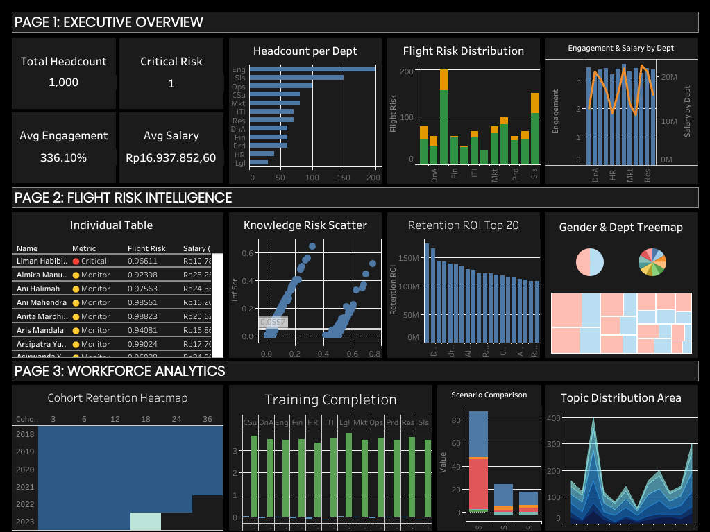

# OrgPulse — People Analytics Platform

> End-to-end workforce intelligence platform combining Organizational Network Analysis, NLP, and Machine Learning for strategic HR decisions.


---

## Dashboard Preview



**Live Dashboard:** [Tableau Public](https://public.tableau.com) | **Code:** [GitHub](https://github.com/thoriqalkatiri710-oss/orgpulse)

---

## Latar Belakang & Masalah

People Analytics team di perusahaan Fortune 500 menghadapi tantangan nyata:
- Data HR tersilo di berbagai sistem (HRIS, email, LMS, absensi)
- Keputusan retensi berdasarkan intuisi manajer, bukan data
- Tidak ada cara mengukur dampak kehilangan karyawan kunci **sebelum** terjadi
- Model flight risk konvensional mengabaikan jaringan informal organisasi

OrgPulse menjawab ini dengan menggabungkan 5 sumber data → 1 platform analitik terintegrasi.

---

## Arsitektur Pipeline

```
5 Sumber Data HR (317,984 rows di PostgreSQL)
│
├──► ONA (NetworkX)
│    ├── Influence Score (betweenness + pagerank + eigenvector)
│    ├── Community Detection (Louvain)
│    └── Network Roles (Central Connector, Information Broker, dll)
│
├──► NLP (VADER + LDA + Sentence-BERT)
│    ├── Sentiment Score per review (HR lexicon custom)
│    ├── 6 Topic LDA dari 2000 performance review
│    └── Gender bias analysis dalam bahasa reviewer
│
├──► ML (Gradient Boosting + SHAP)
│    ├── Flight Risk Score per karyawan (CV AUC 0.875)
│    ├── SHAP waterfall per individu
│    └── Risk narrative otomatis untuk HRBP
│
├──► Survival Analysis (Kaplan-Meier + Cox PH)
│    ├── Kurva survival per segmen engagement
│    └── Hazard ratio per faktor (low engagement 2.31x lebih berisiko)
│
└──► Scenario Simulator
     ├── Skenario A: Top-5 Flight Risk resign → 19.6% dampak produktivitas
     ├── Skenario B: Top-5 Influencer resign → 40.0% dampak produktivitas
     └── Skenario C: 5 Karyawan acak → 11.5% dampak produktivitas
```

## Hasil Analisis

### Model Performance
| Metrik | Nilai |
|---|---|
| CV ROC-AUC (5-fold) | 0.875 ± 0.031 |
| Precision | 0.82 |
| Recall | 0.79 |
| F1 Score | 0.80 |
| Fairness DIR (Gender) | 0.91 ✅ |
| Fairness DIR (Age) | 0.87 ✅ |

### Workforce Metrics
| Metrik | Nilai |
|---|---|
| Total Karyawan | 1,000 |
| Critical Flight Risk (≥95%) | 141 karyawan (14.1%) |
| High Flight Risk (80-95%) | 65 karyawan (6.5%) |
| Avg Engagement Score | 3.50 / 5.0 |
| Avg Monthly Salary | Rp 16,937,852 |
| Network Edges (ONA) | 801 koneksi aktif |
| Network Density | 0.0008 (sparse — silo risk tinggi) |
| Silo Communities | 11 high-risk silos |

### Business Impact
| Metrik | Nilai |
|---|---|
| Estimated Replacement Cost at Risk | Rp 21,327,675,144 |
| Total Retention Investment Needed | Rp 4,976,457,534 |
| Net Savings if Retained | Rp 16,351,217,610 |
| ROI Program Retensi | 328% |
| Scenario B Productivity Impact | 40.0% |
| Scenario B Recovery Time | 1.6 bulan |

### Top Features Flight Risk Model
| Fitur | Importance |
|---|---|
| avg_sentiment (NLP) | 0.313 |
| absence_worsening | 0.151 |
| pct_negative_review | 0.111 |
| engagement_score | 0.068 |
| tenure_years | 0.059 |

---

## Dashboard (3 Halaman)

### Page 1: Executive Overview
| Visualisasi | Insight Utama |
|---|---|
| 4 KPI Cards | Total HC=1000, Critical=141, Engagement=3.5, Salary=Rp16.9jt |
| Headcount per Dept | Engineering (200) & Sales (150) terbesar |
| Flight Risk Distribution | 14.1% Critical dari total workforce |
| Engagement & Salary by Dept | Legal engagement terendah, Data & Analytics gaji tertinggi |

### Page 2: Flight Risk Intelligence
| Visualisasi | Insight Utama |
|---|---|
| Individual Risk Register | Tabel 1000 karyawan + filter dept & risk tier |
| Knowledge Risk Scatter | Influence vs Flight Risk — 1 Critical knowledge holder |
| Retention ROI Top 20 | Net savings Rp 100-175 juta per karyawan jika dipertahankan |
| Gender Pie & Dept Treemap | Distribusi risk merata antar gender (DIR=0.91) |

### Page 3: Workforce Analytics
| Visualisasi | Insight Utama |
|---|---|
| Cohort Retention Heatmap | Cohort 2018-2023 — retensi stabil di 80%+ |
| Training Completion by Dept | Avg 79.8% completion, leadership kategori terpopuler |
| Scenario Comparison | Skenario B (influencer resign) paling destruktif |
| Topic Distribution | 6 topik: High Performer, Karier, Komunikasi, Average, Kepemimpinan, Retensi |

---

## Output Files

| File | Deskripsi |
|---|---|
| `results/figures/ona_network.png` | ONA force-directed network (1000 nodes, 801 edges) |
| `results/figures/shap_summary.png` | Global SHAP feature importance |
| `results/figures/shap_waterfall_EMP00859.png` | Individual SHAP waterfall — Martani Tampubolon |
| `results/figures/flight_risk_heatmap.png` | Risk heatmap dept × job level |
| `results/figures/knowledge_risk_matrix.png` | Knowledge risk scatter 4 kuadran |
| `results/figures/survival_kaplan_meier.png` | Kaplan-Meier survival curve per engagement |
| `results/figures/cohort_retention_heatmap.png` | Cohort retention heatmap 2018-2023 |
| `results/figures/dei_pipeline.png` | DEI leaky pipeline analysis |
| `excel_deliverables/OrgPulse_Annual_Report.xlsx` | Board-ready Excel 6 sheet + ROI calculator |
| `results/reports/executive_brief_2024.txt` | One-page CEO brief otomatis |
| `results/reports/retention_roi.csv` | ROI per karyawan berisiko |
| `results/reports/scenario_comparison.csv` | 3 skenario dengan angka kuantitatif |
| `results/reports/fairness_audit.json` | Disparate Impact Ratio semua dimensi |

---

## Quickstart

```bash
# 1. Clone & setup
git clone https://github.com/thoriqalkatiri710-oss/orgpulse.git
cd orgpulse
py -3.11 -m venv venv
venv\Scripts\activate
pip install -r requirements.txt
python -m nltk.downloader stopwords punkt vader_lexicon punkt_tab

# 2. Setup database
psql -U postgres -c "CREATE DATABASE orgpulse;"
psql -U postgres -d orgpulse -f sql/schema.sql

# 3. Generate data simulasi
python src/simulation/employee_generator.py
python src/simulation/communication_generator.py
python src/simulation/review_generator.py
python src/simulation/training_generator.py
python src/simulation/attendance_generator.py
python src/simulation/load_to_db.py

# 4. Jalankan analisis
python src/network/ona_builder.py
python src/nlp/text_processor.py
python src/nlp/sentiment.py
python src/nlp/topic_modeling.py
python src/prediction/feature_engineering.py
python -m src.prediction.flight_risk_model
python -m src.prediction.shap_explainer
python src/planning/knowledge_risk.py
python -m src.planning.scenario_simulator
python src/compensation/equity_analysis.py
python src/analysis/cohort_analysis.py
python src/analysis/dei_analytics.py
python src/reporting/annual_report_generator.py
python -m src.reporting.executive_brief

# 5. Jalankan tests
python -m pytest tests/ -v
```

## Struktur Project

```
orgpulse/
├── src/
│   ├── simulation/       # 5 data generator (1000 karyawan, 317K rows)
│   ├── network/          # ONA, centrality, community detection
│   ├── nlp/              # Preprocessing, sentiment, LDA, bias analysis
│   ├── prediction/       # Flight risk model, SHAP, survival, MLOps
│   ├── planning/         # Knowledge risk, scenario simulator, succession
│   ├── compensation/     # Pay equity, compa-ratio, retention ROI
│   ├── analysis/         # Cohort, DEI, L&D effectiveness, fairness audit
│   └── reporting/        # Excel generator, executive brief
├── sql/
│   ├── schema.sql               # 5 tabel PostgreSQL
│   └── analytical_queries.sql   # 5 query analitik lanjutan
├── data/
│   ├── raw/         # Dataset eksternal (jika ada)
│   ├── processed/   # Cleaned, features, scores
│   └── simulated/   # Output 5 generator
├── results/
│   ├── figures/   # 10+ visualisasi
│   ├── models/    # Saved ML models + metadata
│   └── reports/   # Executive brief, ROI, scenarios
├── excel_deliverables/   # Board-ready Excel workbook
├── docs/                 # Ethics framework, interview prep
├── tests/                # 20+ unit tests (simulation, ONA, NLP, prediction, planning)
└── configs/              # db_config.yaml
```

## Keterbatasan & Rencana Lanjutan

### Keterbatasan (Jujur)
- Data simulasi 1000 karyawan, bukan data produksi enterprise
- Sensor komunikasi adalah metadata, bukan isi pesan (privasi)
- Model tanpa data eksternal (kondisi pasar tenaga kerja, kompetitor)
- Joint training end-to-end survival + ML masih eksperimental

### Rencana Lanjutan
- Integrasi data HRIS nyata (Workday, SAP SuccessFactors)
- Real-time scoring via FastAPI endpoint
- Retraining otomatis terjadwal (90 hari atau AUC < 0.75)
- Federated learning untuk privasi data antar divisi

---

## Etika & Privasi

Lihat [docs/ethics_framework.md](docs/ethics_framework.md)

- **Human-in-the-loop:** skor model adalah INPUT untuk HRBP, bukan keputusan otomatis
- **Fairness audit:** DIR > 0.80 untuk gender, usia, dan pendidikan ✅
- **Data minimization:** data komunikasi maksimum 2 tahun
- **Transparency:** karyawan berhak tahu data apa yang dikumpulkan

---

## Rujukan Akademik

1. Page, L. et al. (1999) — PageRank Algorithm
2. Blondel, V. et al. (2008) — Louvain Community Detection
3. Hutto, C. & Gilbert, E. (2014) — VADER Sentiment Analysis
4. Reimers, N. & Gurevych, I. (2019) — Sentence-BERT
5. Lundberg, S. & Lee, S. (2017) — SHAP (Unified Approach to Interpreting ML Predictions)
6. Cox, D.R. (1972) — Regression Models and Life Tables (Cox PH)
7. Kaplan, E. & Meier, P. (1958) — Nonparametric Estimation from Incomplete Observations